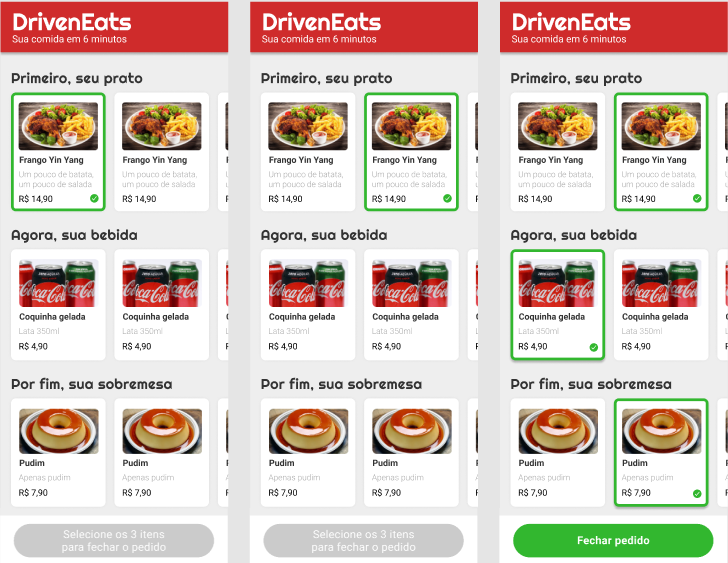

<h1 align="center">Projeto DrivenEats </h1>

<p align="justify">Esse desafio, foi desenvolver a aplicação do DrivenEats a partir de um layout, colocando em prática tudo o que aprendi.</p>
<hr/>
✅ Requisitos

- Versionamento do código
    - [x]  Versionamento usando Git é obrigatório, crie um **repositório público** no seu perfil do GitHub.
    - [x]  Faça *commits* a cada funcionalidade implementada.
- *Layout*
    - [x]  Aplicar layout para *mobile*, seguindo o Figma fornecido (não é necessário implementar um *layout* para *desktop*).
    - [x]  O topo e o botão de fechar pedido devem ter posicionamento fixo e não rolar com a barra de rolagem.
    - [x]  Você pode usar imagens e textos aleatórios para ilustrar a página, porém varie o preço em cada item da mesma categoria.
    - [x]  As fontes utilizadas são: [Righteous](https://fonts.google.com/specimen/Righteous) (nome do restaurante e títulos das categorias) e [Roboto](https://fonts.google.com/specimen/Roboto) (demais textos).
    - [x]  Para fazer as sombras presentes em alguns elementos, pesquise sobre como aplicar sombras em CSS e brinque com os valores até ficar parecido com as imagens do *layout*.
    - [x]  Para fazer os produtos rolarem horizontalmente, utilize `overflow-x: scroll`. No modo desktop um *scroll* é exibido, mas no modo celular não.
- Seleção de itens
    - [x]  Ao clicar sobre um item, ele deve ser marcado como selecionado.
    - [x]  Ao clicar em um item, caso já exista um item selecionado na mesma categoria, este deve ser desmarcado e o novo item clicado deve ser o novo selecionado.
    - [x]  Ao clicar em um item já marcado, não é necessário desmarcá-lo.
- Botão de finalizar pedido
    - [x]  Por padrão, o botão de finalizar pedido deve vir desabilitado. Ao clicar no botão nesse estado, nada deve acontecer.
        - Além de alterar o estilo, use o atributo **disabled** no HTML da tag button.
    - [x]  Quando o usuário tiver selecionado os itens das três categorias, o botão deve mudar para o estado de habilitado.
- Envio do pedido
    - [x]  Ao finalizar o pedido, o usuário deverá ser encaminhado para o WhatsApp Web, em conversa com o contato do restaurante, já com uma mensagem padrão preenchida.
    - [x]  Essa mensagem deverá seguir este formato, o padrão abaixo:
        
        ```
        Olá, gostaria de fazer o pedido:
        - Prato: Frango Yin Yang
        - Bebida: Coquinha Gelada
        - Sobremesa: Pudim
        Total: R$ 27,70
        ```
<hr/>

## 🛠 &nbsp;Skills
<div align="center">
  
  
  
          
  
                                     
</div>
<hr/>

## 🚀 &nbsp;Links

- [Figma](https://www.figma.com/file/i8tceg0W7Z9FfANaDbR3FV/DrivenEats?node-id=0%3A1&t=cKwhDCR0JQPnuE4b-0).<br/>
- [Deploy](https://projeto3-driveneats-gamma.vercel.app/).<br/>
___

## 💬 &nbsp;Contact


Feito por [Raissa Curty](https://github.com/curtyraissa)!

<a href="https://www.linkedin.com/in/raissa-curty/" target="_blank">
    
  </a>&nbsp;
